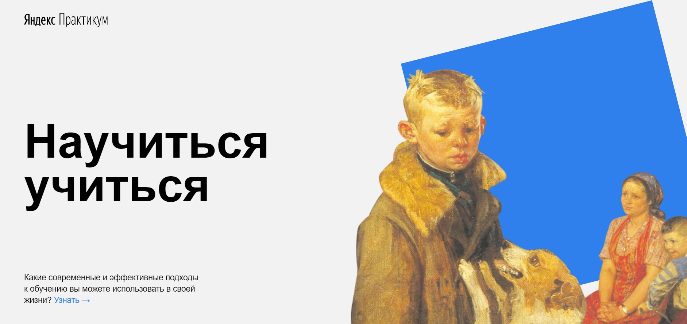
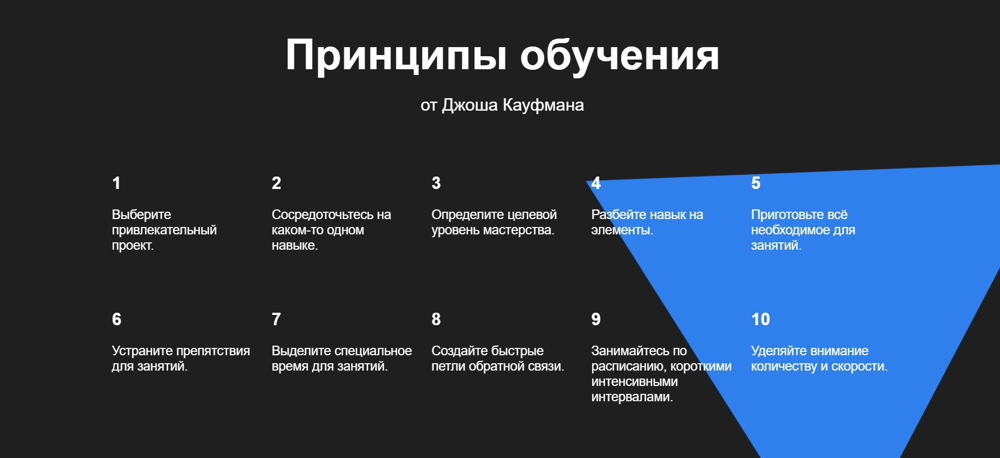
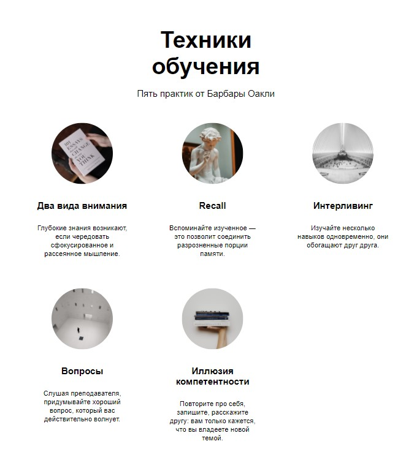

# :mortar_board: A landing about learning methods and tips

A study project at Practicum by Yandex to try:

- CSS, HTML,
- CSS-animation (@keyframes),
- Flexbox,
- BEM.

---

## :mag_right: Preview

---

## :link: Link to test

[GitPages](https://dianadomino24.github.io/how-to-learn/)

---

## :rocket: Technologies

-   semantic **HTML5**, styles - **CSS3** including Flexbox,
-   **BEM**,
-   CSS-animation(@keyframes),
-   YouTube Api,
-   **Figma**, Pixel Perfect.

---

**Practicum by Yandex** - https://practicum.yandex.com/

---

## :sparkles: Thanks for watching!

